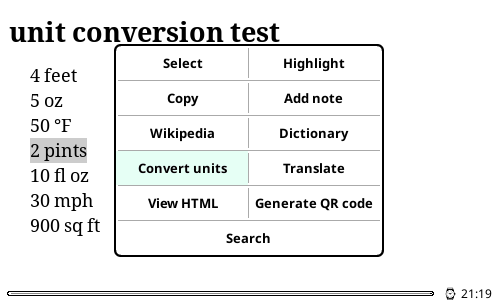
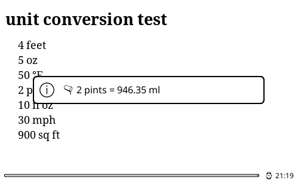

# units.koplugin - lightweight units conversion for KOReader

This plugin is an extremely lightweight alternative to [xray.koplugin][] or [foot-cream][]
— converts units in highlighted (selected) text, and nothing else.

- no background scanning
- no online features
  - no sending all your books to AI
  - no background checking for updates
- no epub rewriting
- no monkeypatching of KOReader internals
- no configuration

It does one thing only: when you select a text, there's an extra "Convert units" button.
Just like with dictionary lookup — use your brain first, look it up if you can't remember.

  
  

Internally, it uses the logic from [xray.koplugin][].
(It's easy to reuse, just one file, thanks!)

[xray.koplugin]: https://github.com/ultimatejimmy/xray.koplugin
[foot-cream]: https://github.com/Fank1/foot-cream

## FAQ

> Why doesn't it recognise and convert "40 degrees", assuming it's the foreign temperature scale?

Because xray.koplugin doesn't. There's a workaround, though:

1. save the Highlight
2. tap it and go to Details
3. tap the Edit text button
4. change it to "40 degrees f" instead
5. close the dialog
6. tap the highlight again
7. tap the … button
8. try Convert units again

Should work for any other unit that isn't recognised, such as "sqft" without the space.

> Is this actively maintained? Do you accept contributions?

Not really, I don't want more features, and
I don't intend to change the conversion logic
which is reused verbatim from [xray.koplugin][].
Conversion bugs need to be fixed there first, then it can be updated here.

Possibly worth implementing:
language/locale support (provided `xray_units.lua` can make use of it);
settings menu (direction and language).
